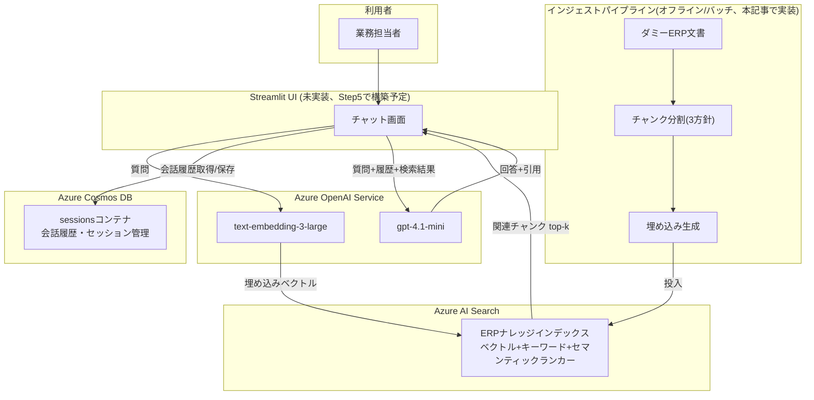

## 1. 概要

### 1.1 やったこと(3行サマリ)

- 過去にNeo4j×LangChain Agentでグラフ×ベクトルのハイブリッドRAGを検証した([個人実証：設備保全ナレッジベースで見えた限界](https://zenn.dev/yuninaka/articles/zenn-graph-rag-limitations)、シリーズを通じて最終的にgolden_qa平均1.00を達成)のに対し、今回はAzureネイティブスタック(Azure OpenAI Service / Azure AI Search / Cosmos DB)で同種のRAGを構築し、比較材料を作った
- Azure AI Searchにハイブリッド検索(ベクトル+キーワード+セマンティックランカー)のインデックスを設計し、3種類のチャンク分割方針(固定512トークン・固定256トークン・見出し単位)を`chunk_strategy`フィールドで同一インデックス内に共存させる設計にした
- Cosmos DBでマルチターン会話履歴・セッション管理を実装し、実リソースに対してレイテンシを実測した(初回280ms、2回目以降平均64.5ms)

題材はERP／基幹システムの導入マニュアル・FAQ・トラブルシュート事例を模した架空のダミーデータ(実データは一切使用していない)。想定読者はAzure OpenAI導入を検討している業務システム担当者。

リポジトリ: [azure-rag-erp-navigator](https://github.com/yuninaka/azure-rag-erp-navigator)
(この記事時点のコード: [`article-1-build-and-session-management`タグ](https://github.com/yuninaka/azure-rag-erp-navigator/tree/article-1-build-and-session-management))

### 1.2 結果だけ先に

| 項目 | 実測値 |
|---|---|
| インデックスへの投入チャンク数(3戦略合計) | 99件(fixed_512: 21 / fixed_256: 38 / heading_aware: 40) |
| Cosmos DB `append_turn`(セッション新規作成込み・初回) | 約280ms |
| Cosmos DB `append_turn`(2回目以降・平均) | 64.5ms |
| Cosmos DB `get_history`(10ターン取得) | 88.1ms |

チャンク分割方針ごとの**精度**比較(golden_qa評価)と、Neo4jグラフRAGとの精度・実装コスト比較は、Step4〜6(RAG回答生成・チャットUI・精度評価)を扱う次回記事で行う。この記事はその前段、「Azureの各マネージドサービスをどう繋いで基盤を作ったか」という構築フェーズの記録です。

## 2. なぜこの技術検証をしたか

グラフRAGの検証では、LangChain AgentとNeo4j AuraDB Freeという、比較的自由度の高い構成でハイブリッド検索エージェントを組んだ。一方、実務でAzure OpenAI導入を検討する企業の多くは、Azure AI SearchとCosmos DBというマネージドサービスを中心に据えた構成を選ぶことが多い。

「同じRAGという題材でも、マネージドスタックに寄せると何が楽になり、何が新たな検討事項になるのか」を実際に手を動かして比較したいというのが今回の動機。特に以下の観点は、Neo4j検証では出てこなかった論点として意識した。

- Azure AI Searchのハイブリッド検索(ベクトル+セマンティックランカー)と、Neo4jのグラフ検索の精度・実装コスト比較
- チャンク分割方針が検索精度に与える影響(複数パターンの比較)
- Cosmos DBを使ったセッション管理のコスト・レイテンシ特性
- マネージドサービス特有の「バージョン間のAPI差異」にどう向き合うか

## 3. アーキテクチャ設計



回答生成モデルには`gpt-4o`ではなく`gpt-4.1-mini`を採用した。理由は単純で、検証用サブスクリプションのクォータ制約でデプロイできるモデルの選択肢が限られていたため。コスト効率の観点でも今回の検証規模には十分と判断した。

## 4. Step1: Azure AI Searchインデックス設計

### 4.1 チャンク分割方針を「後から比較できる」スキーマにする

チャンク分割方針が精度に与える影響を確認したいので、インデックスを分割方針ごとに3つ作るのではなく、**1つのインデックスに`chunk_strategy`フィールドを持たせて共存させる**設計にした。

```python
def _build_fields() -> list[SearchField]:
    return [
        SimpleField(name="id", type=SearchFieldDataType.STRING, key=True),
        SearchableField(name="content", analyzer_name="ja.lucene"),
        SearchField(
            name="content_vector",
            type=SearchFieldDataType.Collection(SearchFieldDataType.SINGLE),
            vector_search_dimensions=EMBEDDING_DIMENSIONS,
            vector_search_profile_name=VECTOR_PROFILE_NAME,
            searchable=True,
            retrievable=False,
        ),
        SearchableField(name="title", analyzer_name="ja.lucene", filterable=True),
        SimpleField(name="section_path", type=SearchFieldDataType.STRING),
        SimpleField(name="source_type", type=SearchFieldDataType.STRING, filterable=True, facetable=True),
        SimpleField(name="source_file", type=SearchFieldDataType.STRING, filterable=True),
        SimpleField(
            name="module_tags",
            type=SearchFieldDataType.Collection(SearchFieldDataType.STRING),
            filterable=True,
            facetable=True,
        ),
        SimpleField(name="chunk_index", type=SearchFieldDataType.INT32),
        SimpleField(name="chunk_strategy", type=SearchFieldDataType.STRING, filterable=True),
        SimpleField(name="last_updated", type=SearchFieldDataType.DATE_TIME_OFFSET, filterable=True, sortable=True),
    ]
```

こうしておけば、次回記事の精度評価では`$filter=chunk_strategy eq 'fixed_512'`のように切り替えるだけで、インデックスを作り直さずに3方針を比較できる。`section_path`(見出しパス)は引用元表示用のフィールドで、どのチャンク戦略でも一貫した方法で付与するようにした(5章で詳述)。

### 4.2 実測でハマった話:次元不一致と`.env`のコピペ事故

インデックス設計を終えた段階では、Azureサブスクリプションがまだ準備できていなかったため、スキーマ定義の単体テストのみで一旦PRをマージした。数日後にサブスクリプションが準備できたので、実リソースに対して疎通確認スクリプトを流したところ、chat・embedding両方のデプロイで`DeploymentNotFound`が返ってきた。

```
{'error': {'code': 'DeploymentNotFound', 'message': 'The API deployment for
this resource does not exist...'}}
```

デプロイ名を実際の値(`gpt-4.1-mini-1`、`text-embedding-3-small`)に直しても症状は変わらず、埋め込み・チャットの両方が同時に失敗するのは「デプロイ名」ではなく「エンドポイント自体」を疑うべきサインだった。`.env`から読み込んだ値をコードから直接ダンプして確認したところ、原因はこれだった。

```
AZURE_OPENAI_ENDPOINT=AZURE_OPENAI_ENDPOINT=https://xxxxx.openai.azure.com/
```

`.env`への手動転記時に、変数名ごとコピーして値の先頭に紛れ込ませてしまっていた。修正すると疎通は通ったが、今度は埋め込み次元数が`1536`と返ってきて、インデックス設計時の`3072`(text-embedding-3-large想定)と食い違った。実際にデプロイされていたのは`text-embedding-3-small`(1536次元)で、当初の設計意図とは異なるモデルが使われていた。`text-embedding-3-large`を追加デプロイして解消し、次元数の一致を確認した。

```python
EMBEDDING_DIMENSIONS = 3072
```

この一件から得た教訓は2つ。**埋め込み・チャットの両方が同時に失敗する場合は、デプロイ名より先にエンドポイントの値そのものを疑う**こと。そして**サブスクリプションのクォータ制約で「設計時に想定していたモデルがそのままデプロイできるとは限らない」**ことを、コードのコメントとして残しておくこと(実際に`index_schema.py`にこの経緯をコメントで残した)。

## 5. Step2: ダミーERP文書のチャンク化・埋め込み・投入パイプライン

### 5.1 ダミーデータセット

架空のERP製品「ERPNavi」を題材に、導入マニュアル5本(初期設定・ユーザー管理・在庫管理・会計・購買)、FAQ、トラブルシュート事例集をMarkdown+YAMLフロントマターで作成した。実企業データは一切使用していない。

### 5.2 3つのチャンク分割方針と`section_path`の一貫性

`fixed_512`/`fixed_256`はtiktoken(`cl100k_base`)によるトークン数固定分割、`heading_aware`はMarkdownの見出し単位分割。どの方針でも、チャンクの引用元表示に使う`section_path`(見出しパス)を同じロジックで算出するようにした。

```python
def _section_path_at(offset: int, headings: list[tuple[int, int, str]]) -> str:
    stack: dict[int, str] = {}
    for heading_offset, level, text in headings:
        if heading_offset > offset:
            break
        stack = {lvl: txt for lvl, txt in stack.items() if lvl < level}
        stack[level] = text
    return " > ".join(stack[level] for level in sorted(stack))
```

固定長チャンクの場合、チャンクの「開始位置」が属する見出しをこの関数で引き当てる。オーバーラップの都合でチャンクの後半に次のセクションの内容が混入することはあるが、`section_path`はあくまで開始位置基準というルールを決めておくことで、挙動が予測可能になる。

### 5.3 コードレビューで見つかった2つのバグ

実装後にコードレビューを通したところ、次の2件が見つかった。いずれもダミーデータでは発生しない条件だったが、将来別のデータセットを使ったときに顕在化しうるものだった。

**見出しが1つもない本文でチャンクが0件になる**: `chunk_heading_aware`は見出しを起点にチャンク境界を作るため、見出しが1つもない本文だと境界が1つもできず、静かに空リストを返していた。

```python
def test_heading_aware_falls_back_to_single_chunk_when_no_headings():
    body = "見出しのないプレーンな本文です。"
    chunks = chunk_heading_aware(body)
    assert len(chunks) == 1  # 修正前は0件だった
```

見出しがなければ本文全体を1チャンクとして返すガードを追加して解消した。

**`overlap_tokens >= max_tokens`で無限ループの恐れ**: 固定長チャンクの窓をずらす幅(`step = max_tokens - overlap_tokens`)が0以下になると、窓の開始位置が進まなくなる。呼び出し側の設定ミスを早期に弾くため、事前にバリデーションを追加した。

```python
if overlap_tokens >= max_tokens:
    raise ValueError(
        f"overlap_tokens({overlap_tokens})はmax_tokens({max_tokens})未満である必要があります"
    )
```

どちらも「今のダミーデータでは起きない」からといって後回しにせず、テストを先に書いて現象を再現してから直す、という順番で対応した。

### 5.4 実リソースへの投入と検索確認

3方針合計99件を実際のAzure AI Searchに投入し、キーワード検索で動作確認した。

```python
results = client.search(
    search_text="在庫の発注点アラートが届かない",
    filter="chunk_strategy eq 'heading_aware'",
    top=3,
    select="title,section_path,source_type,chunk_strategy",
)
```

```
- 在庫管理モジュール設定ガイド | 在庫管理モジュール設定ガイド > 在庫閾値アラートの設定 | manual
- トラブルシュート事例集 | トラブルシュート事例集 > 事例2: 在庫アラートが特定カテゴリの品目でのみ届かない | troubleshooting
- よくある質問(全般) | よくある質問(全般) > Q. 在庫の発注点アラートが届きません | faq
```

マニュアル・トラブルシュート事例・FAQという3種類の文書から、同じ話題(在庫アラート)に関する記述が正しく横断的にヒットした。これは「マニュアルだけでなく過去の問い合わせ履歴も検索対象に含める」という、業務担当者向けRAGの狙い通りの挙動になっている。

## 6. Step3: Cosmos DBでの会話履歴・セッション管理

### 6.1 データモデル:メタデータの点読みでターン番号を採番する

`sessions`コンテナ(パーティションキー`/sessionId`)に、セッションメタデータ(`id == sessionId`)とターン(`id == "{sessionId}-{turn_index:04d}"`)の2種類を同居させた。ターン番号の採番方式には2つの選択肢があった。

1. 毎回`COUNT(1)`クエリで既存ターン数を数え直す
2. メタデータの`turn_count`フィールドを点読みして使う

コストとレイテンシの観点で2を選んだ。Cosmos DBでは単一パーティション内の点読み・patchはクエリより安価かつ低レイテンシであり、実際にこの後の実測でもその差が体感できる結果になった。

```python
def append_turn(self, session_id, user_message, assistant_message, citations=None):
    meta = self.start_session(session_id)  # 点読み、なければ作成
    turn_index = meta["turn_count"]
    ...
    self._container.create_item({...})  # ターン本体
    self._container.patch_item(
        item=session_id, partition_key=session_id,
        patch_operations=[
            {"op": "set", "path": "/turn_count", "value": turn_index + 1},
            {"op": "set", "path": "/last_active_at", "value": turn.created_at},
        ],
    )
```

### 6.2 TTLで自動失効させる設計と、レビューで気づいた非対称性

コンテナを`defaultTtl=-1`で作成し、各ドキュメントに`ttl`フィールド(デフォルト30日)を個別に持たせることで、放置されたセッションを手動削除なしで自動失効させる設計にした。

ただしコードレビューで、この設計に見落としがあることが分かった。Cosmos DBのTTLはドキュメント更新のたびに再カウントされる。`append_turn`は毎ターンでセッションメタデータを`patch_item`更新するため、**会話が続く限りメタデータのTTLは実質リセットされ続けて消えない**。一方、更新されないターンドキュメントは作成から確実に30日で失効する。つまり30日を超える長期セッションでは、最初期のターンだけが会話継続中に静かに消えていく、という非対称性が起こり得る。

意図した設計ではなかったため、今回は実装を変更せず、代替案(全ドキュメントに絶対期限を統一する / Cosmos DBのTTLに頼らず定期削除ジョブで管理する)をコードのdocstringに明記するにとどめた。小規模な検証用途でこの複雑さを作り込むのは過剰と判断したためだが、本番運用ではどちらかの対応が必要になる。

同様に、`create_item`→`patch_item`の直列実行(Transactional Batchではない)についても、後者が失敗すると`turn_count`が更新されずターン番号が重複しうるリスクをドキュメント化した上で、失敗時に警告ログだけ残す軽量な対応にとどめている。「今すぐ完全に直す」より「リスクを認識し、適切に文書化・一部緩和する」ことを優先する、という判断をレビュー対応の方針として明示的に採用した。

同時初回アクセス時の競合(2つのリクエストがほぼ同時に同じ`session_id`で`start_session`を呼び、両方が「存在しない」と判定して両方`create_item`を呼ぶケース)については、409 Conflictを「他のリクエストが先に作成した」正常系として扱い、作成済みのドキュメントを読み直すようにコードを修正した。これは実際に修正した。

### 6.3 レイテンシ実測

```
append_turn x10
  1回目(セッション新規作成込み): 279.3 ms
  2回目以降 平均: 64.5 ms
  2回目以降 最大: 85.2 ms
get_history(10件): 88.1 ms
```

初回のみ約280msと有意に遅いのは、セッションメタデータの存在確認(点読みmiss→404)と新規作成が追加で発生するため。2回目以降は3ラウンドトリップ(点読み→ターン作成→メタpatch)でも60〜90ms程度に収まっており、Azure OpenAIの生成に数百ms〜数秒かかることを考えると、チャットUIの体感への影響は小さいと考えられる。

## 7. 得られた知見

### 7.1 マネージドサービスは「インフラ管理」を消す代わりに「SDKバージョン差異」を持ち込む

Neo4j検証ではDB自体のホスティングを気にする必要がほぼなかったが、Azure AI Search・Cosmos DBでも同様にサーバー管理は不要だった。一方で、`azure-search-documents`が12.0.0という比較的新しいメジャーバージョンだったため、ネットの記事でよく見る`SearchFieldDataType.DATETIMEOFFSET`のような列挙値が実際には`DATE_TIME_OFFSET`だったりと、**「動くはずのサンプルコードがそのまま動かない」場面が何度かあった**。都度インストール済みパッケージのソースを直接読んで確認する必要があり、マネージドサービスならではの「クライアントSDKの世代差」という新しい検討事項に気づけた。

### 7.2 「あり得ないはず」の境界条件は、実データの形状に依存せず先回りする

5.3節のチャンク分割バグ、6.2節のセッション管理の競合状態は、どちらも今回のダミーデータや単一プロセスでの検証では顕在化しない条件だった。しかしテストを先に書いて確認したことで、実際に0件チャンクや409 Conflictが起きることを手元で再現でき、修正の必要性を確信を持って判断できた。「今のデータでは起きないから後回し」にしなかったことが、後から効いてくる典型的なパターンだと思う。

### 7.3 Cosmos DBのコスト・レイテンシ特性は「クエリを避けて点操作に寄せる」ことで大きく変わる

6.1節の採番方式の判断がその実例で、`COUNT`クエリの代わりに点読み+patchに寄せたことで、2回目以降のターン追加が平均64.5msに収まった。単一パーティション内であっても「クエリ」と「点操作(read/create/patch)」ではコスト・レイテンシの特性が異なる、という点はコード上のちょっとした選択が実測値に直結することを確認できた良い例だった。

## 8. まとめと今後

Azure OpenAI Service・Azure AI Search・Cosmos DBという3つのマネージドサービスを繋いで、ERP導入ナビゲーターRAGの基盤(インデックス設計・インジェストパイプライン・セッション管理)を構築した。実リソースに対する検証を通じて、次元不一致・`.env`のコピペ事故・チャンク分割のバグ・セッション管理の競合状態という4つの実際の問題を発見し、それぞれ修正または文書化した。

この記事は全3回シリーズの第1回(構築編)です。

- **第1回(本記事)**: Step1〜3(インデックス設計・インジェストパイプライン・セッション管理)
- **第2回(予定)**: Step4〜6(RAG回答生成・引用元提示・チャットUI・golden_qa精度評価)。ここでチャンク分割方針ごとの精度比較と、Neo4jグラフRAGとの精度・実装コスト比較を行う予定
- **第3回(予定)**: Step7〜8(Azure App Serviceデプロイ・GitHub Actions CI/CD・Bicepによる IaC化)。マネージド構成での運用上の利点・注意点を扱う予定

次回は実際にRAG回答生成ロジックを実装し、golden_qaでの精度評価とグラフRAGとの比較に進みます。
