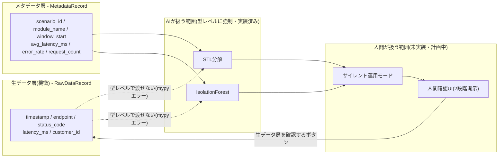

再現性の確認や実装の詳細を追う場合は、以下のリポジトリを参照されたい。

リポジトリ: [log-anomaly-detection-poc](https://github.com/yuninaka/log-anomaly-detection-poc)
(この記事時点のコード: [`article-metadata-only-anomaly-detection`タグ](https://github.com/yuninaka/log-anomaly-detection-poc/tree/article-metadata-only-anomaly-detection))

## サマリ

- 顧客の機密データを扱うドメインで、AIが機微データ(生ログ・実データ)に一切触れない設計のまま異常検知としての価値を出せるか、というPoCである
- ログレコードを「メタデータ層」「生データ層」の2つのdataclassに分離し、検知アルゴリズムがメタデータ層しか受け取れないことを型レベルで強制した。この分離が壊れていないこと自体をテストでも検証しており、実装・テストの両面で成立している
- STL分解・IsolationForestの2手法で精度を実測した結果、recallは高い(74〜100%)一方でprecisionは低く(フィルタ後も8〜13%程度)、大半が誤検知だった
- この結果は、固定閾値の検知器だけでは実運用に耐えないことを示しており、検知結果を即座に通知しないサイレント運用モードと、最終判断を人間に委ねる人間確認フローが必要であることを裏付けている

## Part1: 課題設定

近年、システムのログをAIで継続的に監視し、障害の予兆を早期に検知する仕組みが広がっている。この仕組みは大きく2層で構成される。

1つ目は「ログを吐き出させる後付け層」である。多くの既存システムは監視を前提に設計されていないため、エージェントやサイドカーによる計装、バイトコードレベルの計装(APM)、CDC(Change Data Capture)、Syslog転送、ネットワークミラーリングといった非侵襲的な手段で、システムの外側からログを収集する。

2つ目は「AIによる異常検知層」である。収集・正規化されたログに対して、正常時のベースラインを統計的手法や機械学習で学習し、そこからの逸脱を検知する。近年はさらに、検知した異常の根本原因をLLMが自然言語で要約する機能が付加されることも増えている。

この仕組みを、顧客の機密データを扱い、第三者提供制限や顧客への説明・同意が契約上求められるようなドメインに適用しようとすると、いくつかの課題に直面する。扱うデータそのものが守秘義務の対象であり、生ログや実データを分析に使う場合、外部のLLMへの送信は委託先契約上の第三者提供制限や顧客への説明・同意の観点でハードルが高い。クラウドサービス側がテナント内で処理を完結させるオプションを提供していたとしても、それは技術的な安全性を高めるだけであり、契約上の第三者提供制限そのものを解消するわけではない。

一方で、「異常の絞り込み」という目的に限れば、統計的な検知手法はシナリオID・実行時間・期待値との差分といったメタデータのみを扱えば機能し、必ずしも生ログや実データそのものに触れる必要はない。

この「AIが機微データに一切触れない設計のまま、どこまで異常検知としての価値を出せるか」という問いが、今回のPoC着手の動機である。

なお、統計的な検知手法は生ログに触れずに機能する一方、固定閾値による検知は一般に誤検知が多くなりやすいことも知られている。そのため今回のPoCは、単発の検知精度だけでなく、検知結果を即座に通知せず精度を見極める仕組みや、最終判断を人間に委ねる仕組みまでを見据えた、段階的な構成であらかじめ設計している。

このPoCは、型分離の検証(本記事のPart2)、検知精度の実測(Part3)を経て、サイレント運用モードや人間の確認を挟むフロー、さらには機微データを含む判断が必要な場面でのみ人間の確認後にLLMを使う根本原因分析まで、段階を追って検証する構成であらかじめ計画している。各段階の設計・実装はリポジトリのREADMEに記録している。

## Part2: 型レベルのデータ分離設計

今回のPoCの核心は、ログレコードを「メタデータ層」と「生データ層」という2つのdataclassに明確に分離し、異常検知アルゴリズムがメタデータ層のオブジェクトしか受け取れないことを、実行時のチェックではなく型レベルで強制した点にある[^step3]。

`MetadataRecord`は5分バケット単位のレコードで、シナリオID・モジュール名(エンドポイント相当)・実行時刻・平均レイテンシ・エラー率・リクエスト数のみを持ち、機微情報を一切含まない。異常検知アルゴリズムに渡してよいのはこの型のみである。一方`RawDataRecord`はリクエスト単位のレコードで、タイムスタンプ・ステータスコード・レイテンシの実測値に加え、顧客IDを模したダミー文字列を持つ。これは人間が明示的に確認を選択した場合にのみ表示してよく、検知アルゴリズムには絶対に渡してはならない層である。

```python
@dataclass(frozen=True)
class MetadataRecord:
    scenario_id: str
    module_name: str
    window_start: datetime
    avg_latency_ms: float
    error_rate: float
    request_count: int


@dataclass(frozen=True)
class RawDataRecord:
    scenario_id: str
    timestamp: datetime
    endpoint: str
    status_code: int
    latency_ms: float
    customer_id: str
```

この2つは通常のPython dataclassとして定義しており、検知関数の型シグネチャは`Sequence[MetadataRecord]`のみを受け付ける。`RawDataRecord`のリストを渡すコードを書くと、mypyが型チェック時にエラーとして検出する。構造が似ていても別クラスとして扱われる、通常のnominal typingの性質をそのまま利用した設計であり、特別なライブラリは使っていない。

重要なのは、この型分離が壊れていないこと自体をテストで検証している点である[^type-test]。正しい呼び出し(`MetadataRecord`を渡す)と誤った呼び出し(`RawDataRecord`を渡す)の2つのコード片を用意し、それぞれに対してmypyをsubprocessとして実行、前者はexit code 0、後者はexit code 1(かつ`RawDataRecord`という文字列を含むエラー)になることを確認するテストを書いた。さらに、検知関数の型シグネチャを意図的に緩めた場合にこのテストが実際に失敗することも確認済みである。テストコード自体が「型分離の崩れ」を検知できるかどうかを、テストの外側から検証したことになる。

リポジトリのREADMEには、この境界を示すアーキテクチャ図を置いている[^readme-arch]。



`AI`側(STL分解・IsolationForest)には`RawDataRecord`が型レベルで渡せないことを、点線の矢印で示している。

## Part3: 精度検証結果

メタデータ層のみを入力として、2種類の異常検知アルゴリズムを実装し比較した[^step4]。1つは統計的手法のSTL分解(Seasonal-Trend decomposition using LOESS)で、モジュール(エンドポイント)ごとに時系列分解を行い、平均レイテンシとエラー率それぞれの残差を標準化したzスコアの大きい方を異常スコアとする。もう1つは機械学習のIsolationForestで、モジュールごとに平均レイテンシとエラー率の2特徴量でモデルをfitし、`contamination="auto"`(正解ラベルを一切使わないscikit-learn内部の推定)で異常判定する。リクエスト数を特徴量に含めなかったのは、深夜の正常な低トラフィックが誤検知の原因になるためである。

学習データ量を1週間・2週間・1ヶ月と変えながら、正解ラベル(`anomaly`のみを陽性、`noise`は陰性として扱う)と突き合わせてprecision/recallを算出した結果は以下の通りである。各セルは**フィルタ前→フィルタ後**の値[^readme-results]。

| 日数 | STL precision | STL recall | IsolationForest precision | IsolationForest recall |
|---|---|---|---|---|
| 7日 | 0.043→0.133 | 0.900→1.000 | 0.007→0.080 | 0.900→1.000 |
| 14日 | 0.028→0.000 | 0.786→N/A | 0.004→0.000 | 0.786→N/A |
| 30日 | 0.042→0.103 | 0.745→0.857 | 0.009→0.060 | 0.941→1.000 |

「フィルタ」とは、5分バケット内のリクエスト数が5件未満のバケットを評価対象から除外する処理である。低トラフィックのバケットは平均レイテンシの分散が統計的に安定せず、誤検知の主因になっていた。閾値は固定値(STLはzスコア3、IsolationForestは`fit_predict`の判定をそのまま使用)であり、データ量ごとの最適値探索は行っていない。

結果から読み取れるのは、recallは総じて高い(74〜100%)一方で、フィルタ後もprecisionは8〜13%程度に留まり、大半が誤検知だったという事実である。原因は、低トラフィックバケットでの分散不安定性(STL)と、`contamination="auto"`がデータの一定割合を機械的に外れ値として拾う挙動(IsolationForest)にあると考えている。なお14日分のrecallが「N/A」なのは0%ではない。たまたまそのシードで異常イベントが低トラフィック帯に偏って発生し、フィルタ後に評価可能な正例が0件になったために評価不能となったものであり、意図的に隠さず記録した[^na-note]。

単発の検知精度だけに頼らず段階的な仕組みを組み込むという当初の設計方針は、実測データによっても裏付けられた形になった(前掲図の「人間が扱う範囲」が計画中である理由でもある)。

## むすび

このPoCで証明できたのは、AIが機微データに一切触れない設計を型レベルで強制しながら、異常の絞り込みとして機能しうる仕組みが成立するということである。一方、実測されたrecall・precisionを踏まえても、実運用に耐える精度にはまだ届いていない。次はサイレント運用モードと人間確認フローを実装し、誤検知を人間の判断に橋渡しする部分を検証したい。実装の詳細はリポジトリを参照されたい。これらは当初からのロードマップの一部であり、進捗はリポジトリのREADMEで随時更新している。

リポジトリ: https://github.com/yuninaka/log-anomaly-detection-poc

[^step3]: 実装はPull Request [#8](https://github.com/yuninaka/log-anomaly-detection-poc/pull/8)、コミット[`7b8bfcd`](https://github.com/yuninaka/log-anomaly-detection-poc/commit/7b8bfcd1b748568a966fb63cb90becbf51c6f2d1)。READMEの「メタデータ層と生データ層の型分離(Step3)」節を参照。
[^type-test]: 検証コードは`tests/test_type_separation.py`・`tests/type_fixtures/`(PR #8に同梱)。
[^readme-arch]: README「アーキテクチャ(Step0〜4の実装範囲と、Step5〜7の計画)」節の図をそのまま引用。
[^step4]: 実装はPull Request [#10](https://github.com/yuninaka/log-anomaly-detection-poc/pull/10)、コミット[`0b450fb`](https://github.com/yuninaka/log-anomaly-detection-poc/commit/0b450fb91681ab643d240b1ee44b9824eaafc97b)。READMEの「異常検知と精度評価(Step4)」節を参照。
[^readme-results]: 数値はREADME「実測結果」節の表をそのまま転記。
[^na-note]: precision/recallの0除算(分母が0)を「0.0」ではなく「N/A」として区別する修正はコミット[`afc2193`](https://github.com/yuninaka/log-anomaly-detection-poc/commit/afc2193d66b9e02dadf2b3459d6e7f0a13989637)(PR #10)。
